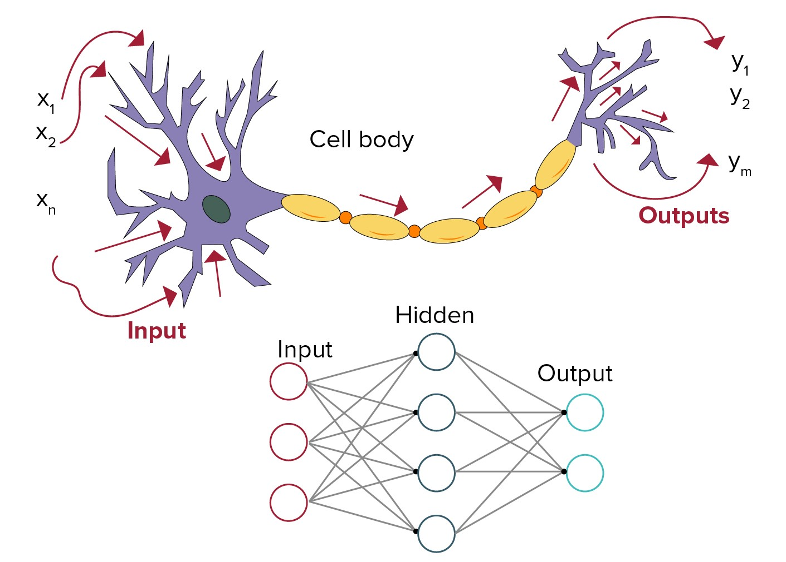
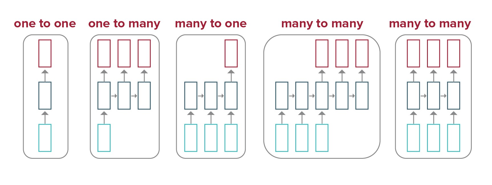
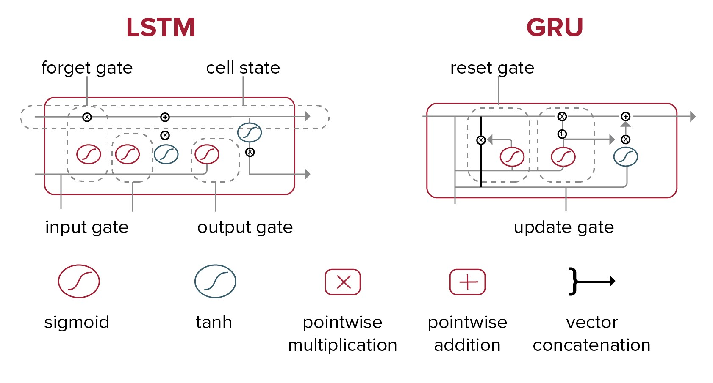

# MIT-Designing-and-Building-AI-Products-and-Services

This repository contains my learning notes from MIT course on Designing and Building AI Products and Services. These
notes are self prepared to learn the course better and it is solely my work.

# Module 1

## Learn the basics of AI, ML, NLP and Deep learning:

[1] Machine learning:

- Teach machines to identify the patterns from the trained data.
- Allow computer to find the pattern so it can learn.
- 3 types of learning:
    - Supervised Learning
    - Unsupervised
    - Semi-Supervised.

[2] NLP:

- Allow computer to interact in human languages
- Ex: Language translation service; Chatbots.

[3] Deep Learning:

- Mimics the structure of Brain & function of Brain.
- Like brain has network of neurons to learn, reasoning ect. Deep learning has neural networks
- It has multiple layers of data processing between input and output.
- This allows to identify the very complex PATTERNS from the data like text, images, sound or combination of all.
- Ex: Computer vision - Face recognition; Self-driving cars ect.

## Introduction to AI Design Process:

### 4 stages of AI design process:

[1] Intelligence
[2] Business process
[3] AI Technology
[4] Tinkering

#### [1] first stage of the AI design process: Identifying the desired behavior of the AI product.

- Most important criteria of decisions is:
    - performance metrics : Error rate of image recognition.
    - scope : self-driving car. what all objects need to be recognized.

- Natural Language processing:
    - Sentiment Analysis
    - Summarize document
    - Summarize news
    - Answer questions
    - Maintain dialog
    - Analyze Reviews like google reviews

    - Sentiment analysis progress includes:
        - Coreference resolution. Ex: Identifying the expressions referring to text.
        - Word sense disambiguation
        - Parsing

#### [2] Business process:

- Two main areas where AI can help Business processes:
    - Strategic
    - Operational

[2.1] Strategic:

- Product Layer : Use the best AI product like build best fingerprint sensor.
- Customer Solution: Use AI product for best computer vision to incorporate in Self-driving car.
- Network Externalities : Build a large database of users so others can be more useful. Like more fingerprints in DB
  allows us to identify the people.

[2.2] Operational:

- Business process: Focus on operational process description like reduce the legal translation cost by using AI model in
  the legal translation service.
- Sensible Improvement targets: More measurable points like reduces the cost of translation by 80%.

#### [3] AI Technology

- Two main areas:
    - Intellectual Property (IP)
    - Data approach

[3.1] IP:

- Identify the process or business use case we are trying to achieve using AI technology.
    - Ex: Summarizing the claims documents using AI OR Sentimental analysis of sales calls transcripts.

[3.2] Data Approach:

- Data is the BASE for any AI technology.
- Metadata (which is data of the data) includes - Date, time, Collection mechanism and Content description.
- Thousands of patents are awarded yearly for a wide spectrum of AI use cases.
- Any AI use case should justify below 3 areas:
    - Network externalities
        - larger community size
        - larger asset attractiveness
        - bigger value per user

    - System lock-in
        - Customer lock-in
        - More revenue per customer
        - Bigger loyalty

    - Economies of scale
        - Bigger R&D budget
        - Bigger margins
        - Low operating cost

[3.3] Exercise:

1. News Article: I read the news article about how AI is reshaping the auto-insurance industry.

https://www.kiro7.com/news/role-ai-shaping-auto-insurance/OPJ5GK7ILFJQJLCRBARDOD5MEU/#:~:text=Can%20Smart%20Technology%20Help%20You,pricing%20system%20feel%20fairer%20overall.

2. Advantages of AI : AI analyses users driving pattern like - speed, braking, amount of driving and majority what time
   of the day user drives. These data identifies tha pattern of driving and co-relation with safe driving and accidents.

[2.1] Network externalities:

When more users joined this program, machine learning models will get vast amount data to identify the patterns and find
correlation.
AI can differentiate between low risk and high risk drivers. This provides lower premium to safe drivers and thus it
gives large audience attractiveness.
AI can find the pool of safe drivers, this allows lower premium cost to safe drivers.

[2.2] System lock-in

AI establishes the pattern of safe driving, this allows insurance companies to provides discount and low cost insurance
which boost customer lock-in.
Lower premium attracts more customers which provides more revenue. Customer stays longer and creates loyalty with the
business.

[2.3] Economies at scale:

More revenue allows the auto-insurance to spend more on R&D to improve the AI models to make it more efficient.
The safer drivers have low probability of claims and thus lower money spend on them, This increases profit margins.

AI models identifies the safe and risky drivers by analyzing their driving pattern. This allows auto-insurance company
to have less human resources in reviewing the application and claims which provides low operating cost.

[3] Business Perspective:

AI allows the business to identify and segregate the safe and risky drivers based on their driving profile. This allows
business to provides more discount and fair and competitive price to the customer which attracts more customer and
generates the loyalty for the long term commitment.

AI analysis allows the business to provide the fair prices to customer based on their driving history which other
competition might not have.

[4] Customer perpective:

- Customer understands that AI is gathering the data to analyze the driving profile. This encourages customers to follow
  specific rules to keep getting the discounted price for the auto-insurance. This enables the customers to get the
  lower premium.

#### [4] Tinkering

[4.1] Software development

[4.2] AI Cancers:

- Adversarial attacks:
    - Any adversarial noise in the data can create the wrong output.
    - Ex: Small stickers on stop sign can cause Self driving cars believe that stop sign is actually speed post which
      might cause issue.

- Lack of generalization:
    - Translation accuracy from language A to B does not guarantee translation accuracy of language A to C.
    - For ex: Face recognition softwares developed by Microsoft Azure OR aws has millions of face images which
      over-trained model on images but did not consider the same image with makeup and other edits.

- Bias:
    - GPT2 had a biased responses.

- Explainability:
    - Wolf vs dogs image recognition shows biased result because wolf with snow in background and dog with home
      background.

- Unintended Behavior:
    - Ex: Robot with AI fell down on escalator in a mall and injured other customer.
    - NLP model gave bad advice to the customer.

#### [5] Activity on Software development plan cost analysis:

[1] Will the costs for integrating your virtual assistant device with an NLP align with the development costs itemized
in the spreadsheet?

- No, NLP integration with the virtual assistant is very complex project. In the cost analysis worksheet, we did NOT
  consider the cost associate with the model fitting and accuracy testing.
- We need to allocate the budget and resources to perform comparison analysis of the different NLP models.
- Also need to verify the accuracy of the various models to determine which NLP models is the right solution to our
  problem.

[2] In which areas can you reduce your development costs?

- I would save cost on Hardware and Network cost by going with Open AI models and API integration. This way, we do NOT
  need to provision heavy processing GPUs and rather make the API calls to the Open AI NLP models from cloud.
- I'd also outsourced some of the development work related to integration to offshore countries to reduce the cost of
  software development.

[3] In which areas will your development costs exceed the estimates presented in the spreadsheet?

- Consider the complex nature of the NLP model integration, the labor costs might increase. There are certain unknown
  blockers the development team might face which increases the estimated time of development and thus it increases the
  cost.
- Another area could be the maintenance, when the virtual assistant gets more traction with user and increases the
  usage, it significantly consumes more GPUs utilization which end-up increasing the cost.

[4] Does the spreadsheet account for the costs of your data needs?

- The speadsheet mentioned about the software licensing cost but did NOT mention anything about the NLP model
  integration cost. It should be clearly defined about the type to NLP model can be used, comparison of various models
  to identify the optimal model and scalability of NLP model when the user base growth. Also, it did not mention the
  token optimization to avoid paying higher for each query.

[5] What is your contingency plan if you exceed your resources or allotted project development time?

- In cost analysis, we put 10% of total implementation cost as a contingency. Based on the experience and research I
  feel the contingency plan should be at least 20 - 30% of the total allocated budget.
- I'd divide the project into iteratively development plan. I should analyse all the features and prioritize the most
  useful ones. Also, I finalize the deliverables for the Minimum Viable Product (MVP) and based on the remaining budget,
  I'd go for the additional features.

[6] Is this plan worth funding? Why or why not?

- Though this project performed quite analysis and prepared project development documentation, It misses out many
  important areas like model comparison and complex development cost. Also it takes very optimistic approach on the
  timeline, which considering the complex nature of the development plan is very tightly set. In addition to that,
  contingency plan is also very optimistic and did not provide enough margins for the error. I feel the plan is not
  worth the funding at this point and deep re-evaluation is necessary.

#### [6] AI Cancers Activity:

[1] News Article: AI can perpetuate racial bias in insurance
underwriting (https://finance.yahoo.com/news/ai-perpetuates-bias-insurance-132122338.html)

[2] Describe how your selected product or process integrates AI.

- Recently, more and more Auto insurance companies rely on AI models for the insurance underwriting and predicting
  drivers profile.
- These models consider the parameters like acceleration, brakes, amount of driving and more. In addition to that AI
  models also considers the zip codes where the drivers drive and frequency of driving to the particular area. It also
  identifies the probabilities of accidents in certain areas based on the past accident data to train the AI model on
  the process of insurance underwriting.

[3] Identify the type of AI cancer that the article describes.

- Article mentioned that AI model uses zip codes as a mask to identify the socioeconomic status of the person. AI give
  biased results based on the zipcode data which passively profile the socioeconomic structure of the person.
- This bias can be seen in terms of racially profiling the driver and predicting the underwriting of the auto insurance
  premium.
- This includes the principles of lack of generalization and biased behaviors.

[4] Discuss how you’d prevent or mitigate the effects of AI cancer in your selected product or process.

- I'd incorporate the more generalized data and parameters while training the models. This will allow the AI model to
  avoid any biased against the race or socioeconomic factors. Also, I use un-masked parameters which nullify the proxy
  behavior in training the model.

# Module 2: Artificial Intelligence Technology Fundamentals: Machine Learning.

#### In this module, you'll learn how to discriminate between different machine learning algorithms. You will learn about each topic from theoretical as well as practical points of view. You'll begin with a discussion of linear classifiers and decision trees and then look at machine learning algorithms that use probabilistic approaches, such as Bayesian or regression models.

#### [2.1] Machine Learning:

- ML is a field of AI which allows computers to learn from data without being explicitly programmed. In other words,
  computer identifies the patterns based on the data provided, based on this pattern machine can derive the results.

- There are 3 types of ML:
    - Supervised
    - Semi-Supervised
    - Unsupervised.

#### [2.1.1] Supervised ML

- In Supervised learning, ML models are trained on LABELED data. Labels are desired output of the data.
- For Ex: ML models to identify spam OR authentic emails. Here, ML model is trained on datasets of emails which has
  labeled emails into spam and authentic emails.
- This helps models to analyze the pattern between spam and authentic emails. This will allow ML model to identify spam
  emails based on pattern analysis from training labeled datasets.

[A] Regression :

- Common Algorithms:
  [1] Linear Regression : Creates best fit line to predict a value based on single input variables.Ex: Predicting the
  house price based on num of bedrooms, predicting stock price based on gdp data ext.
  [2] Support Vector Regression: For more non-linear relationships.

[B] Classification : This is used for predicting discrete categories, such as classifying an image as a cat or a dog.

- Common algorithms include:
  [1] Logistic regression: This predicts the probability of an event belonging to a specific class (often used for
  binary classification).
  [2] Decision trees: This creates a tree-like structure to classify data based on a series of questions about the
  features.
  [3] k-nearest neighbors (KNN): This classifies data points based on the labels of their nearest neighbors in the
  training data.

[ ] Taxonomy of Machine Learning:

# Module 3 : Artificial Intelligence Technology Fundamentals: Deep Learning

- Deep learning provides greater flexibility and power in building AI products. You'll begin the module with a
  discussion of artificial neural networks and learn about its basic component: the neuron.
- Next, you’ll explore the multi-layer perceptron — an advanced structure consisting of multiple layers of artificial
  neural networks. You’ll also consider architectures that can be used to customize neural networks, such as
  autoencoders, and explore various types of neural networks and their applications in the form of convolutional neural
  networks and more sophisticated deep neural networks.
- Finally, you’ll reach the end of the module with an investigation into an architecture developed to deal with sequence
  data: recurrent neural networks.

### [3.1] Task - Identify the application of Neural Network OR deep learning algorithm in business.

- Neural Network / Deep learning Algorithm in Auto Insurance claims
  appraisal - https://scholar.smu.edu/cgi/viewcontent.cgi?article=1181&context=datasciencereviewLinks to an external
  site.

- Neural networks and deep learning algorithms, particularly Convolutional Neural Networks (CNNs), are applicable in the
  auto insurance industry for tasks such as claims processing, damage assessment, fraud detection, and risk modeling. A
  paper in the SMU Data Science Review explores applying deep learning, computer vision, and neural networks to
  automotive
  damage appraisal, proposing a workflow combining image analysis and statistical modeling to predict claim costs.

- The article indicates that this method, using an advanced neural network algorithm and techniques like Mask R-CNN, can
  improve accuracy and efficiency, potentially cutting labor costs by half and reducing appraisal time from days to
  hours.

### [3.2] An artificial neural network (ANN) is a computer program inspired by the workings of the human brain.

- As the brain uses interconnected neurons, an ANN uses artificial neurons connected in a network. Each artificial
  neuron receives input, such as a pixel value (like handwritten numbers), and processes it to produce an output.
- This output is passed to other neurons in the network. The strength of the connection between neurons, called weights,
  determines the influence one neuron has on another. During training, the network adjusts these weights based on the
  examples it receives so that it gets better at recognizing patterns in the data.

#### Basic neural network architecture with input, hidden, and output layers.

- The basic parts of an ANN are:

- Input layer: This is the first layer of the network, where the input data is fed into the network. Each neuron in this
  layer represents a feature or input variable.

- Hidden layers: These are layers in between the input and output layers. Each hidden layer consists of neurons that
  perform computations on the input data. The number of hidden layers and neurons in each layer can vary depending on
  the
  complexity of the problem.

- Weights: Each connection between neurons in adjacent layers has a weight associated with it. These weights determine
  the
  strength of the connection and are adjusted during the training process to improve the network's performance.

- Activation function: Each neuron in the network applies an activation function to the weighted sum of its inputs. This
  function introduces nonlinearity to the network, allowing it to learn complex patterns in the data.

- Output layer: This is the final layer of the network, where the network's output is generated. The number of neurons
  in
  the output layer depends on the type of problem the network is solving (e.g., classification or regression).

- Bias: Each neuron typically has an associated bias, which allows the network to learn the optimal decision boundaries
  for the data.

- Loss function: This function measures how well the network is performing by comparing its output to the true labels in
  the training data. The goal of training is to minimize this loss function.

- Optimizer: The optimizer is responsible for adjusting the weights of the network during training to minimize the loss
  function. Popular optimizers include gradient descent, stochastic gradient descent (SGD), and Adam, which are used to
  update the model's parameters based on the gradients calculated during backpropagation.

- Layers connectivity: The way neurons in adjacent layers are connected can vary. In a fully connected layer, each
  neuron is connected to every neuron in the adjacent layer.

Perceptron model: inputs, weights, summation, activation, output.

Comparison Between Biological Neurons and Artificial Neurons

ANNs are inspired by the structure and function of the human brain.

Structure: Both human neurons and artificial neurons have a similar structure, with inputs, a processing unit, and
outputs.
Function: Information is passed from one neuron to another through connections.
Learning: Both systems are capable of learning from experience. In the human brain, this involves synaptic plasticity,
where the strength of connections between neurons is adjusted based on the patterns of activity. In ANNs, learning is
typically achieved through algorithms that adjust the weights of connections between neurons based on the error in the
network's predictions.

Activation: Both human neurons and artificial neurons use an activation function to determine their output based on the
inputs they receive. This allows both systems to model complex, nonlinear relationships in data.

Parallel processing: Both systems are capable of parallel processing, where multiple neurons or processing units can
perform computations simultaneously.

Fault tolerance: Both systems exhibit some degree of fault tolerance. In the human brain, this is due to the redundancy
of connections between neurons. In ANNs, this can be achieved through techniques such as dropout, which randomly removes
connections between neurons during training to prevent overfitting.

#### Step-by-Step Learning Using Gradient Descent

Neural network diagram illustrating forward and backward propagation processes.

Initialize weights: Start by initializing the weights of the neural network to small random values. These weights are
the parameters that the network will learn during training.
Forward pass: Perform a forward pass through the network. This involves propagating the input data through the network
to compute the output. Each neuron in the network calculates its output based on the weighted sum of its inputs and
applies an activation function to this sum.
Compute loss: Calculate the loss, which is a measure of how well the network's output matches the true output (the
labels in the training data).
Compute gradient of loss: Calculate the gradient of the loss function with respect to the weights of the network.
Update weights: Update the weights of the network using the gradient descent algorithm. The weights are updated in the
opposite direction of the gradient to minimize the loss.
Repeat: Repeat steps 2–5 for a fixed number of iterations (epochs) or until the loss converges to a satisfactory level.
Each iteration through the entire dataset is called an epoch.
Evaluate: After training is complete, evaluate the performance of the network on a separate validation or test dataset
to see how well it generalizes to new, unseen data.
Adjust hyperparameters: Experiment with different hyperparameters (learning rate, number of hidden layers, number of
neurons per layer, etc.) to improve the performance of the network.
By iteratively updating the weights of the network using the gradient descent algorithm, the network learns to make
better predictions and minimize the loss function, thereby improving its performance on the task it is trained for.

#### Types of Activation Function Used in ANNs

There are different types of activation functions used in ANNs. Some of the common ones are the following:

Sigmoid: The sigmoid function is a smooth, S-shaped curve that maps input values to a range between 0 and 1. It is often
used in the output layer of a binary classification problem, where the network needs to predict probabilities.
Hyperbolic tangent (tanh): The tanh function is similar to the sigmoid function but maps input values to a range between
−1 and 1. It is often used in hidden layers of the network.
Rectified linear unit (ReLU): The ReLU function is a simple nonlinear function that returns 0 for negative inputs and
the input value for positive inputs.
Leaky ReLU: Leaky ReLU is similar to ReLU but allows a small, nonzero gradient for negative inputs. This helps to
mitigate the "dying ReLU" problem, where neurons can become inactive and stop learning.
Softmax: The softmax function is often used in the output layer of a multi-class classification problem, where the
network needs to predict probabilities for each class. It converts the raw output values into probabilities that sum up
to 1.

Other terminologies related to deep learning:

Epoch: One complete presentation of the entire training dataset to the learning algorithm — multiple epochs are often
required to adequately train a model

Batch size: The number of training examples utilized in one iteration of model training

Dropout: A regularization technique that involves randomly setting a fraction of input units to 0 at each update during
training time, which helps to prevent overfitting

Transfer learning: Leveraging a pretrained model on a new, related problem — popular in deep learning where large
datasets are required to train a model from scratch

### [3.3] Single Layer VS Multi-Layer Perceptron:

- A perceptron is a type of artificial neuron or a basic building block of neural networks. It was first introduced in
  1957 by Frank Rosenblatt. The perceptron is a simple model inspired by how a single neuron in the brain works. In its
  original form, it takes multiple binary inputs (0 or 1), each with an associated weight that determines its
  importance. The perceptron computes a weighted sum of its inputs, adds a bias term, and then applies an activation
  function to produce an output.

Neuron structure with dendrites, axon, and nucleus, compared to a simplified mathematical model.

The output y is a weighted sum of the inputs x1, x2….xn and weights w1, w2, ….wn with a bias term x0. An activation
function is applied to the weighted sum to produce the output y. Perceptrons were initially used for binary
classification tasks, where they could learn to separate two classes of data that are linearly separable.

Activation Functions

Choosing the right activation function for a deep learning model is crucial, as it significantly affects the model's
ability to learn complex patterns and converge during training. In the original perceptron model, the activation
function was a simple step function that outputs 1 if the weighted sum is above a certain threshold and 0 otherwise.

Sigmoid
When to use it: The sigmoid function is primarily used in the output layer of binary classification models, where the
goal is to predict probabilities that are mapped between 0 and 1.

Why use it: It outputs values between 0 and 1, which are interpretable as probabilities.

Limitation: It suffers from vanishing gradients, which makes it less ideal for deep networks with many layers.

Hyperbolic Tangent (tanh)
When to use it: Tanh is useful in hidden layers where data needs to be normalized around 0, thus aiding in faster
convergence.

Why use it: It outputs values between −1 and 1, effectively centering the data.

Limitation: Like the sigmoid function, tanh also suffers from vanishing gradients in deep networks.

Rectified Linear Unit (ReLU)
When to use it: ReLU is the default choice for many types of neural networks, especially in hidden layers of deep
networks.

Why use it: It helps mitigate the vanishing gradient problem, allowing models to learn faster and perform better. ReLU
only activates a neuron if the input is positive, which introduces nonlinearity without affecting the scale of the input
for positive values.

Limitation: ReLU suffers from the "dying ReLU" problem, where some neurons effectively die during training and stop
outputting anything other than 0.

Leaky ReLU
When to use it: Leaky ReLU is a variant of ReLU, which is used to address the dying ReLU problem.

Why use it: It allows a small, positive gradient when the unit is not active and so keeps the update alive during the
training process.

Limitation: Its effectiveness can depend significantly on the choice of the small gradient.

Softmax
When to use it: Softmax is typically used in the output layer of a multi-class classification model.

Why use it: It squashes the outputs of each class into a probability distribution ranging between 0 and 1, where the sum
of all probabilities is 1.

Limitation: It is only suitable for the output layer.

For practical implementation, start with ReLU for most scenarios because of its simplicity and efficiency, and then
experiment with other functions if you encounter issues with model training or performance.

For more information, refer to the resource below:

Brownlee, J. (2021, January 22). How to choose an activation function for deep learning Links to an external site..
Machine Learning Mastery: Making Developers Awesome at Machine Learning.

Single-Layer Perceptron

A single-layer perceptron (SLP) is a type of neural network that consists of only one layer of output nodes. It is
typically used for binary classification problems where the classes are linearly separable. Here are some scenarios in
which a single-layer perceptron is appropriate:

Linearly separable data: If your data can be separated into two classes by a linear decision boundary, a single-layer
perceptron can be used to learn this boundary.
Simple binary classification: SLPs are suitable for simple binary classification tasks where you want to classify inputs
into two categories.
Efficiency: SLPs are computationally efficient and can be trained quickly compared to more complex models such as
multi-layer perceptrons.
Interpretability: The output of a single-layer perceptron can be easily interpreted since it directly reflects the
decision boundary learned by the model.
Memory constraints: SLPs require less memory compared to deeper neural networks, making them suitable for environments
with limited memory resources.
A single-layer perceptron is not suitable for a linearly nonseparable problem. A linearly nonseparable problem requires
hidden layers in the neural network for classification. See the Python code for an XOR problem, which is linearly
nonseparable:

XOR truth table and plot demonstrating the impossibility of linear separation between classes.

Multi-Layer Perceptron

A multi-layer perceptron (MLP) is a type of artificial neural network that consists of multiple layers of nodes,
including an input layer, one or more hidden layers, and an output layer. Each node in a layer is connected to every
node in the adjacent layers, and each connection has an associated weight. In an MLP, each node (or neuron) in the
hidden layers and the output layer applies an activation function to the weighted sum of its inputs to produce an
output. The most commonly used activation functions are the sigmoid, tanh, or ReLU functions. MLPs are capable of
learning complex nonlinear relationships in data, making them suitable for a wide range of tasks, including
classification, regression, and pattern recognition. They are trained using algorithms such as backpropagation, which
adjusts the weights of the connections between neurons to minimize the difference between the predicted output and the
actual output.

### [3.4] Autoencoders and TensorFlow:

An autoencoder is a type of artificial neural network used for unsupervised learning. It aims to learn efficient
encoding of input data, typically for dimensionality reduction, feature learning, or data denoising. The autoencoder
consists of two main parts: an encoder and a decoder.

Encoder: The encoder takes the input data and transforms it into a compressed representation, often called a "code" or "
latent representation."
Decoder: The decoder takes the compressed representation from the encoder and attempts to reconstruct the original input
data.
The goal of training an autoencoder is to minimize the difference between the input data and the reconstructed data. By
doing so, the autoencoder learns to capture the most important features of the input data in the compressed
representation. Autoencoders have various applications, including image and video compression, anomaly detection, and
generative modeling. They are a foundational concept in deep learning and can be extended and modified in many ways to
suit different types of data and tasks.

TensorFlow

Autoencoders can be implemented in Python using deep learning libraries such as TensorFlow or PyTorch. TensorFlow is an
open-source machine learning framework developed by Google. It provides a comprehensive ecosystem of tools, libraries,
and community resources that make it easy for researchers and developers to build and deploy machine learning models.
TensorFlow is designed to be flexible and scalable, allowing users to build models ranging from simple linear
regressions to complex deep learning architectures. It supports both traditional machine learning and deep learning, and
it provides APIs for several programming languages, including Python, C++, and JavaScript. One of the key features of
TensorFlow is its ability to efficiently leverage hardware accelerators such as GPUs and TPUs, making it suitable for
training large-scale models. It also provides tools for visualization, model serving, and deployment, making it a
complete solution for the entire machine learning workflow.

Steps for Building an Autoencoder With TensorFlow

Step 1. Data Preparation: Load and preprocess the dataset. For example, for image data, you might normalize pixel values
and reshape the images.

Step 2: Model Definition: Define the architecture of the autoencoder. This includes the encoder and decoder components,
as well as any additional layers or operations needed.

Step 3: Loss Function: Define the loss function to measure the difference between the input and the output of the
autoencoder. For example, you might use mean squared error or binary cross-entropy.

Step 4: Optimizer: Choose an optimizer to minimize the loss function during training. Common choices include Adam, SGD,
and RMSprop.

Step 5: Training: Train the autoencoder using the training dataset. This involves feeding the input data through the
model, calculating the loss, and updating the model parameters using the optimizer.

Step 6: Evaluation: Evaluate the performance of the trained autoencoder using a separate validation or test dataset.
This can involve calculating metrics such as reconstruction error or visualizing the reconstructed images.

Step 7: Inference: Use the trained autoencoder for inference on new data. This involves passing new data through the
encoder to get the encoded representation, and then through the decoder to get the reconstructed output.

Python Code Using TensorFlow for an Autoencoder

The necessary packages are first imported.

import numpy as np

import tensorflow as tf

from tensorflow.keras.layers import Input, Dense

from tensorflow.keras.models import Model

from tensorflow.keras.datasets import mnist

import matplotlib.pyplot as plt

Keras is a high-level neural networks API that is used for building and training deep learning models. Keras provides a
simple and intuitive interface for building neural networks, allowing developers to quickly prototype and experiment
with different architectures. Keras is integrated into TensorFlow as the tf.keras module, which provides full
compatibility with TensorFlow's ecosystem and allows users to take advantage of TensorFlow's features while using the
Keras API.

Data Preparation

# Load the MNIST dataset

(x_train, _), (x_test, _) = mnist.load_data()

# Normalize pixel values to between 0 and 1

x_train = x_train.astype('float32') / 255.

x_test = x_test.astype('float32') / 255.

x_train = np.reshape(x_train, (len(x_train), 28, 28, 1))

x_test = np.reshape(x_test, (len(x_test), 28, 28, 1))

# Flatten the images for the autoencoder

x_train_flat = x_train.reshape((len(x_train), np.prod(x_train.shape[1:])))

x_test_flat = x_test.reshape((len(x_test), np.prod(x_test.shape[1:])))

In the data preparation phase, first the MNIST dataset is loaded. Then, it is normalized, and the images are flattened.
This is required because of the following reasons:

Normalization: Normalizing the pixel values of images (scaling them to a range between 0 and 1) helps in ensuring that
the model trains faster and more accurately. It also makes the optimization process more stable by preventing large
input values from dominating the learning process. Normalization helps to ensure that the model focuses on learning the
patterns in the data rather than being sensitive to the scale of the input values.

Flattening: In the case of image data, flattening refers to converting the 2D image arrays (e.g., 28x28 pixels for MNIST
images) into 1D arrays. Flattening the images ensures that each pixel value is treated as a separate input feature by
the model, allowing it to learn spatial patterns and relationships in the image. Flattening is used in this example
because the autoencoder is built with fully connected (Dense) layers. Convolutional autoencoders, which are commonly
used for image data, maintain the spatial structure and do not require flattening.

Model Definition

# Define the autoencoder model

input_img = Input(shape=(784,))

encoded = Dense(128, activation='relu')(input_img)

encoded = Dense(64, activation='relu')(encoded)

encoded = Dense(32, activation='relu')(encoded)

decoded = Dense(64, activation='relu')(encoded)

decoded = Dense(128, activation='relu')(decoded)

decoded = Dense(784, activation='sigmoid')(decoded)

autoencoder = Model(input_img, decoded)

The architecture of the autoencoder is defined with the number of layers and the activation function. The dense function
has different parameters. In this example, the first parameter is units. In the autoencoder, the number of units is
typically chosen to reduce the dimensionality of the input data in the encoder and increase it back to the original
dimensionality in the decoder. The next parameter activation uses the “Relu” activation function.

Loss Function and Optimizer

# Compile the model

autoencoder.compile(optimizer='adam', loss='binary_crossentropy')

In autoencoder models, various optimizers and loss functions can be used, depending on the specific task and the nature
of the data. The most commonly used optimizers are Adam, stochastic gradient descent (SGD), and RMSprop.
Different loss functions can also be used. The most popular among them are mean squared error, binary cross-entropy, and
Kullback–Leibler divergence.

Training

# Train the autoencoder

autoencoder.fit(x_train_flat, x_train_flat,

                epochs=50,

                batch_size=256,

                shuffle=True,

                validation_data=(x_test_flat, x_test_flat))

The autoencoder fit function is used to train the model on a dataset. It includes the following parameters:

Training Data: This argument represents the input data (features) that the model will be trained on. For an autoencoder,
this would be the same dataset used for both the input and the target output.

Validation Data: This argument represents the unseen data on which the model is validated.

Batch Size: This argument specifies the number of samples per gradient update. This parameter controls how many samples
are processed before the model's parameters are updated.

Epochs: This argument specifies the number of epochs (iterations over the entire dataset) to train the model. One epoch
is completed when the model has trained on each sample in the dataset once.

Shuffle: By using shuffle=”True”, the training data is shuffled before each epoch. This ensures that the model sees the
data in a different order in each epoch, which can help in generalizing better to unseen data and prevent overfitting.

Encoding and Decoding

# Encode and decode some digits

encoded_imgs = autoencoder.predict(x_test_flat)

decoded_imgs = autoencoder.predict(x_test_flat)

The predict function in an autoencoder (or any other model) is used to generate output predictions for the input data.
In the context of an autoencoder, the predict function takes an input sample, passes it through the encoder to get the
encoded representation, and then passes the encoded representation through the decoder to reconstruct the input data.

First, the input data is passed through the encoder layers of the autoencoder to get the encoded representation. This
step compresses the input data into a lower-dimensional latent space representation.

Then, the encoded representation is then passed through the decoder layers of the autoencoder to reconstruct the input
data. The decoder tries to reconstruct the input data from the encoded representation, aiming to minimize the
reconstruction error. The output of the predict function is the reconstructed output data, which should ideally be a
close approximation of the original input data.

Inference

# Display the original and reconstructed images

n = 10

plt.figure(figsize=(20, 4))

for i in range(n):

    # Display original

    ax = plt.subplot(2, n, i + 1)

    plt.imshow(x_test_flat[i].reshape(28, 28))

    plt.gray()

    ax.get_xaxis().set_visible(False)

    ax.get_yaxis().set_visible(False)

 

    # Display reconstruction

    ax = plt.subplot(2, n, i + 1 + n)

    plt.imshow(decoded_imgs[i].reshape(28, 28))

    plt.gray()

    ax.get_xaxis().set_visible(False)

    ax.get_yaxis().set_visible(False)

plt.show()

In inference, you visualize the original and reconstructed images. Matplotlib is used in this case for this
visualization.

Handwritten digits from 7, 2, 1, 6, 4, 7, 7, 9, 8, 5, 9 displayed in a grid

This is the output for encoder and decoder after 50 epochs.

### [3.5] Convolution Neural Network:

CNNs are a class of deep neural networks, most commonly applied to analyzing visual imagery. They are highly effective
for tasks such as image recognition, classification, and segmentation. CNNs are inspired by the organization of the
animal visual cortex and are designed to automatically and adaptively learn spatial hierarchies of features from the
input data.

Analogy With the Visual Cortex in Animals

In both animal visual cortexes and CNNs, the first stage is feature extraction. In feature extraction, the basic
features are extracted. These can be edges, corners, or textures. The next stage is the hierarchical representation
stage. Both systems build a hierarchical representation of visual information. In animals, this hierarchy progresses
from simple features, such as edges, to complex features, such as shapes and objects. In CNNs, each layer learns to
represent features at a different level of abstraction, with higher layers capturing more complex patterns based on the
features learned by lower layers. Next is the adaptation and learning stage. Both systems are adaptive and capable of
learning from experience. In animals, this learning occurs through exposure to the environment. In CNNs, learning occurs
through the training process, where the network adjusts its weights based on the input data to improve its performance
on a specific task. Last is the plasticity stage. Both systems exhibit a degree of plasticity, meaning they can adapt to
changes in the environment or task requirements. In animals, this is reflected in the ability to learn new visual
concepts or adapt to changes in the visual environment. In CNNs, this is achieved through retraining the network on new
data or fine-tuning existing weights for a new task.

#### Different Layers of CNNs

Architecture of a CNN: Input layer, two convolutional layers, two max-pooling layers and a fully-connected output layer

CNNs typically consist of several types of layers, with each serving a different purpose in the network architecture.
Here are the key layers commonly found in CNNs:

Input Layer: This layer accepts the input data, which is typically an image or a volume of images. The input layer's
dimensions are determined by the size and shape of the input data.
Convolutional Layer: The convolutional layer applies convolution operations to the input data using filters (kernels).
Each filter is slid across the input data, and the dot product of the filter and the input at each position is computed
to produce a feature map. The convolutional layer learns to extract features from the input data, such as edges,
textures, and shapes.
Activation Layer: After the convolution operation, an activation function such as rectified linear unit (ReLU) is
applied element-wise to introduce nonlinearity into the network. This allows the network to learn complex patterns and
relationships in the data.
Pooling Layer: The pooling layer down samples the feature maps produced by the convolutional layers. Common pooling
operations include max pooling and average pooling, which reduce the spatial dimensions of the feature maps while
retaining important information.
Fully Connected Layer: Also known as a dense layer, the fully connected layer connects every neuron in the previous
layer to every neuron in the current layer. This layer is typically used in the final stages of the network for
classification or regression tasks, where the network outputs a prediction based on the learned features.
Flattening Layer: Before passing the output of the convolutional/pooling layers to the fully connected layers, the
feature maps are flattened into a vector. This allows the fully connected layers to process the features as a
single-dimensional input.
Normalization Layer: Sometimes, normalization layers, such as batch normalization, are used to normalize the input to a
layer, which can improve the training speed and stability of the network.
Output Layer: The output layer produces the final output of the network, which depends on the task the network is
designed for. For example, in classification tasks, the output layer might use a softmax activation function to output
probabilities for each class.
These layers are typically stacked sequentially to form the complete CNN architecture. The specific arrangement and
number of layers can vary based on the complexity of the task and the desired performance of the network.

Python Implementation of CNNs

Step 1: Import the necessary libraries.

import tensorflow as tf

from tensorflow.keras import layers, models

CNNs are implemented using TensorFlow. First, the libraries are imported. The MNIST dataset is used in this case. The
MNIST dataset is a large dataset of handwritten digits that is commonly used for training and testing machine learning
models, especially in the field of computer vision. It stands for the "Modified National Institute of Standards and
Technology" dataset, as it is a modified version of the original NIST dataset. The MNIST dataset consists of 60,000
training images and 10,000 test images, each of which is a grayscale image of size 28x28 pixels. Each image is labeled
with the corresponding digit it represents, ranging from 0 to 9. The MNIST dataset is widely used as a benchmark in the
machine learning community for developing and testing algorithms for tasks such as image classification, digit
recognition, and deep learning. Due to its relatively small size and simplicity, it is often used as a starting point
for learning and experimenting with new machine learning techniques.

Step 2: Load the MNIST data.

# Load the MNIST dataset

mnist = tf.keras.datasets.mnist

(x_train, y_train), (x_test, y_test) = mnist.load_data()

The dataset is loaded as train and test datasets.

Step 3: Preprocess the data.

# Preprocess the data

x_train, x_test = x_train / 255.0, x_test / 255.0

x_train = x_train.reshape(x_train.shape[0], 28, 28, 1)

x_test = x_test.reshape(x_test.shape[0], 28, 28, 1)

During preprocessing, the pixel values of the images in the dataset are normalized in the range of 0 to 1 by dividing
the pixel value by 255. This is done to improve the convergence of the training process. The input data is then reshaped
to make it have a single channel. In this case, the images are reshaped to have a shape of (28, 28, 1), where 28x28 is
the image size and 1 represents the single channel grayscale.

Step 4: Build the CNN model.

model = models.Sequential()

model.add(layers.Conv2D(32, (3, 3), activation='relu', input_shape=(28, 28, 1)))

model.add(layers.MaxPooling2D((2, 2)))

model.add(layers.Conv2D(64, (3, 3), activation='relu'))

model.add(layers.MaxPooling2D((2, 2)))

model.add(layers.Conv2D(64, (3, 3), activation='relu'))

model.add(layers.Flatten())

model.add(layers.Dense(64, activation='relu'))

model.add(layers.Dense(10, activation='softmax'))

The first step is to create a sequential model. This is a common approach in Keras for building neural networks with a
linear stack of layers. Next, the Conv2D layer is added. It is a fundamental building block in CNNs and plays a crucial
role in enabling the network to learn features from input data. The Conv2D layer has several parameters that can be
adjusted, such as the number of filters, the size of the filters, the step size of the convolution operation, and the
padding method. These parameters affect how the convolution operation is applied and can impact the network's ability to
learn and generalize from the data. Next, a max pooling layer with a pool size of (2, 2) is added. This down samples the
feature maps to reduce computation. The high-level features are learned by using a dense layer with 64 units and a ReLU
activation function. The MNIST dataset helps in classification of digits from 0 to 9. This classification is
accomplished by using a dense layer with ten units and the softmax activation function for multi-class classification.

Step 5: Compile the model.

# Compile the model

model.compile(optimizer='adam',

              loss='sparse_categorical_crossentropy',

              metrics=['accuracy'])

The compile() method is called on the model object, where the optimizer, loss function, and metrics are specified. This
step creates the computation graph for the model and prepares it for training. The optimizer used in this case is an
“adam” optimizer, and the loss function is a “sparse_categorical_crossentropy.” The accuracy is the metric, which is
computed here.

Step 6: Train the model.

# Train the model

model.fit(x_train, y_train, epochs=5, validation_data=(x_test, y_test))

The model is trained using the model.fit method. The parameters in this case are the training data, the test data, and
the number of epochs.

Step 7: Evaluate the model.

test_loss, test_acc = model.evaluate(x_test, y_test)

print(f'Test accuracy: {test_acc}')

Model evaluation is a crucial step in the machine learning workflow, as it provides insights into how well the model
generalizes to unseen data and helps assess its suitability for real-world applications. Here, the test_loss and
test_acc values are computed using the model.evaluate function on the test dataset.

CNNs have a wide range of applications, especially in computer vision. They are widely used in image classification,
object detection, semantic segmentation, face recognition, natural language processing, and video analysis. Their
ability to learn hierarchical features from data makes them a versatile and powerful tool in computer vision and NLP.

### [3.6] Recurrent Neural Network:

Recurrent neural networks (RNNs) are a type of artificial neural network designed to recognize patterns in sequences of
data, such as text, speech, or time series. Unlike traditional feedforward neural networks, which process input data in
a single direction, from input to output, RNNs have connections that form directed cycles, allowing them to exhibit
dynamic temporal behavior. This enables them to maintain a memory of previous inputs, making them well-suited for tasks
that involve sequential data. In an RNN, each neuron (or node) in the network receives input not only from the previous
layer's neurons but also from its own previous time step, creating a feedback loop. This feedback loop allows RNNs to
maintain a state or memory of previous inputs, which can be useful for tasks such as speech recognition, language
modeling, and machine translation.

Sequence of nodes. Each has input X and bias h, processes through A and passes to the next node, representing an RNN.

A simplified way of representing the RNN is by unfolding/unrolling the RNN over the input sequence. For example, if a
sentence as input to the RNN has ten words, then the network would be unfolded such that it has ten neural network
layers.

#### Types of RNN

RNNs were introduced to store results of previous outputs in the internal memory. There are four types of RNN:

#### Different types of sequence-to-sequence models: one-to-one, one-to-many, many-to-one, many-to-many.

One-to-one: This has one input and one-p output. It has fixed input and output sizes and is commonly used in image
classification.
One-to-many: One-to-many is a type of RNN that expects multiple outputs on a single input given to the model. The input
size is fixed and gives a series of data outputs. Its applications can be found in applications such as music generation
and image captioning.
Many-to-one: A many-to-one RNN converges a sequence of inputs into a single output by a series of hidden layers learning
the features. Sentiment analysis is a common example of this type of RNN.
Many-to-many: Many-to-many RNNs are used to generate a sequence of output data from a sequence of input units. The input
and output sizes may or may not be equal. This is commonly used in machine translation.
Different Architectures of RNNs

The three most popular types of RNNs are:

1. Bidirectional recurrent neural networks (BRNNs): BRNNs process input sequences in both forward and backward
   directions,
   allowing the network to capture information from past and future time steps simultaneously, making them especially
   effective for tasks where context from both directions is important, such as sequence labeling or
   sequence-to-sequence
   tasks.

Bidirectional recurrent neural network.

2. Gated recurrent units (GRUs): This is another type of RNN architecture, similar to long short-term memory (LSTM)
   networks. GRUs combine the forget and input gates into a single "update gate," which controls how much of the past
   information should be passed along to the future. Additionally, GRUs have a "reset gate" that helps the model decide
   how
   much of the past information to forget. The key difference between GRUs and LSTMs is the way they manage and use
   their
   memory cells.

Comparison of LSTM and GRU cell architectures with gate mechanisms and operations.
Long short-term memory (LSTM): LSTM networks are designed to overcome the vanishing gradient problem of traditional
RNNs, which occurs when the gradients of the loss function become very small, leading to difficulties in learning
long-range dependencies. LSTM is useful in a variety of sequential data tasks as it is well suited for learning and
remembering patterns over long sequences.
For more information on GRU and LSTM, see Illustrated Guide to LSTM’s and GRU’s: A step by step explanation Links to an
external site.

Applications of RNNs

Natural language processing:
Language modeling: Predicting the next word in a sentence
Text generation: Generating text based on learned patterns in data
Machine translation: Translating text from one language to another
Speech recognition: Transcribing spoken words into written text
Time series prediction:
Stock price forecasting: Predicting future stock prices based on historical data
Weather forecasting: Predicting weather conditions such as temperature and humidity
Music generation:
Automatically composing music by learning patterns and styles from various music sequences
Video analysis:
Activity recognition by understanding the sequence of frames in videos

# [4] Module 4: Introduction to deep learning and Generative AI

### [4.1] IP and Residual Network:

- Challenges of Deep Neural Networks

Vanishing/Exploding gradients: As the network depth increases, gradients can become very small (vanishing) or very
large (exploding), leading to inefficient training.
Degradation problem: Increasing the depth of the network leads to saturation and degradation in performance.
Optimization difficulty: Deeper networks can become harder to optimize effectively.
Understanding Residual Networks (ResNets)

Residual networks, or ResNets, are a type of deep learning model specifically designed to address the challenges of
training very deep neural networks. They were introduced by Kaiming He and his colleagues in the 2015 paper Deep
Residual Learning for Image Recognition Links to an external site. and have since become a cornerstone in the field of
computer vision.

Key Concepts of ResNets:

Handling the degradation problem
Problem: As neural networks become deeper, they are expected to perform better. However, in practice, deeper networks
often suffer from higher training-error rates. This is known as the degradation problem, where adding more layers to a
deep network can result in performance that is worse, not better.

Solution: ResNets solve this issue by introducing residual connections, which allow gradients to flow through the
network more effectively.

Residual learning
Instead of learning the desired mapping directly, ResNet models learn the residuals, or differences, between the desired
mapping and the input.

Initially, the desired mapping is H(x). We let the networks, however, fit the residual mapping F(x) = H(x)-x, as the
network found it easier to optimize the residual mapping rather than the original mapping.

Skip connections
Skip connections, or shortcut connections, bypass one or more layers by connecting an earlier layer to a later layer.

These connections help alleviate the vanishing-gradient problem by providing alternative paths for gradients to
backpropagate, ensuring that the network can learn effectively, even with increased depth.

Building blocks
Residual Block: The fundamental building block of ResNet consists of a few stacked layers and a shortcut connection that
bypasses these layers.

Architecture: A typical residual block involves two or three convolutional layers with batch normalization and ReLU
activation, and the output of these layers is added to the block's input, forming the output of the block.

- ResNet variants
  ResNet models come in various depths, commonly known as ResNet18, ResNet34, ResNet50, ResNet101, and ResNet152, with
  the number representing the total number of layers.

Impact on Performance

Accuracy: ResNets have significantly improved performance on challenging benchmarks such as ImageNet, leading to better
accuracy compared with previous architectures.

Training: The architecture's design allows for easier and more effective training of very deep networks, enabling models
to achieve higher accuracy without degradation.

Practical Applications of ResNets

Image classification: ResNets are widely used in image classification tasks due to their ability to handle complex
patterns and large datasets effectively.

Object detection: ResNets serve as a backbone for many object detection frameworks, providing robust feature extraction
capabilities.

Image segmentation: The architecture's depth and residual connections make it suitable for tasks requiring detailed
image segmentation.

He, K., Zhang, X., Ren, S., and Sun, J. (2015) Deep residual learning for image recognition Links to an external site..
Microsoft Research.

# [6] Module 6: Designing Intelligent Human–Computer Interfaces

In this module, you'll focus on the definition and analysis of human–computer interaction (HCI) by learning about the
different interfaces, applications, and processes that define the technology. In Module 5, you learned about
transformers and generative artificial intelligence (AI). In this module, the human element is added, with the videos
and activities covering the techniques, application areas, benefits, and drawbacks of HCI.

In addition, you'll become familiar with the top conferences that address the latest HCI technologies and examine
real-world applications of HCI that incorporate AI. You'll also learn about how to stay on track with the latest HCI
technologies and how to define a comfortable level of involvement when using AI products. Finally, you'll learn how to
use AI to your advantage in order to prevent and overcome challenges and have the opportunity to design an HCI of your
own.

### Application AI in Manuafacturing:

- There is a research at MIT labs that developed a material (photochromic dye) which can change the color and appearance
  by simply passing
  the projection light on it.
- They can change the color, design and apprarance so many times without any issues.
- The application of this research is to apply (For ex) on shoes.Every day we change the design and appearance of the
  shoes to make it look new.
- Another example is to apply this on Car where we can change the color by simply projecting special lights on the car
  to make it look new and changed based on preference.

- Google's Smart Compose feature in Gmail uses AI prediction to offer word and phrase suggestions as users type, thereby
  advancing human-computer interaction. By analyzing context with large-scale language models trained on anonymized
  data,
  it generates personalized, non-intrusive suggestions that are easily accepted with a keystroke. This reduces typing
  effort and speeds up communication, making the interface more efficient and user-centered without compromising
  privacy.

- [1] What type of AI is used?
- Smart Compose is powered by a neural language model. It reportedly employs a hybrid model that combines bag-of-words
  encoding with a recurrent neural network (RNN) language model.

- [2] Does the AI integration create a better or worse interface?
- The AI integration is generally seen as a positive enhancement. It improves the interface by reducing user effort,
  increasing composition speed, and lowering cognitive load. Suggestions are offered in a non-disruptive way, ensuring
  users retain control.

- [3] Does AI contribute to development efficiency?
- Yes, AI contributes to development efficiency for both the user and the developer. For users, it quickens the writing
  process. For developers, it allows them to use pre-trained language models instead of manually coding auto-complete
  rules, which leads to faster scaling and continuous improvement as the model learns.
